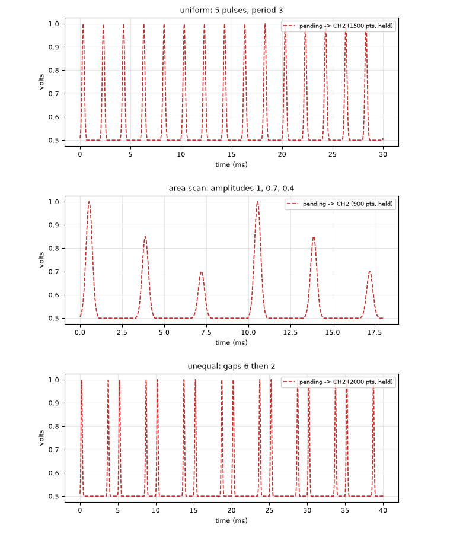
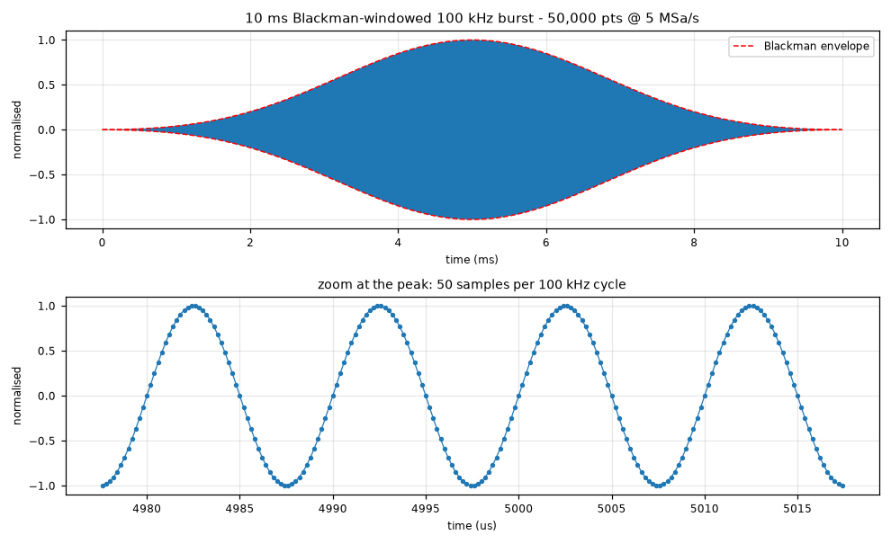
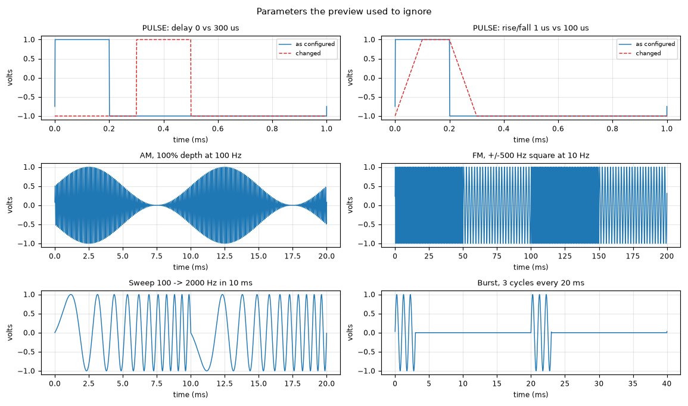
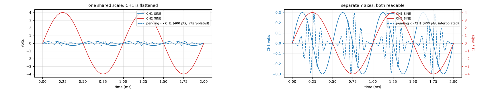
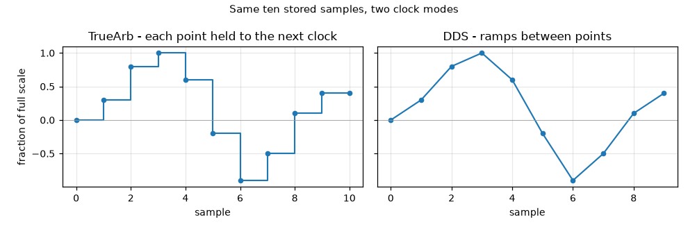

# BK4063B AWG GUI

Panel control for a B&K Precision 4063B arbitrary waveform generator. The mirror
image of [Scope Grab](../scope-grab): instead of pulling a capture off an
instrument, this pushes a setup onto one. Same shape - single file, PyVISA over
the rear-panel USB-B port, no vendor software.

Edit the panel, press **Apply changes**, and the generator follows. Press
**Save setup** and the whole instrument state lands in a timestamped JSON you can
recall later or file alongside the data it produced.

| File | Contents |
|------|----------|
| `<prefix>_<timestamp>.json` | Full instrument state - every SCPI block for both channels, verbatim. This is what Recall reads. |
| `<prefix>_<timestamp>.txt` | The same thing laid out for reading: output state, load, wave, modulation |

## Requirements

- NI-VISA, or any VISA runtime (Keysight IO Libraries works too - the 4063B shows
  up either way)
- Python 3.9+
- `pip install pyvisa numpy matplotlib`

Matplotlib is optional; without it you lose the waveform preview and nothing else.

## Usage

```
pythonw bk4063b_awg_gui.py
```

`pythonw` keeps the console window from appearing. The app auto-connects to the
first 4063B it finds on USB; hit **Connect** to retry.

## Outputs are never switched for you

This is the one place where a generator panel differs from a capture tool: a wrong
click here puts a voltage into something.

- **Apply changes**, **Recall setup** and closing the window never touch an output
  switch. Only the **ON** / **OFF** buttons do.
- **confirm before switching an output on** (on by default) puts a confirmation in
  front of anything that changes what a live channel is emitting: switching an
  output on, applying to a channel that is already on, or uploading an arb to one.
  The dialog quotes the generator's own last-read setting, not whatever unapplied
  edit is sitting in the panel.
- The lamp beside each channel reads **ON** in red or **OFF** in green, taken from
  the generator on every read - not from what the panel last asked for.

Closing the app leaves a running channel running. That is deliberate: shutting a
control panel should not interrupt something the bench is in the middle of.

## The panel

Each channel gets output state, load and polarity; a wave type with its
parameters; arb selection and sample clock; and one modulation/sweep/burst row.

- **Greyed cells** are the parameters the current settings give no meaning to,
  and Apply ignores them even if they still hold a number from a previous type.
  This works at two levels: the arb row only applies to `ARB`, and within it
  **Sa/s** only applies to the **TrueArb** clock, since DDS derives
  its timing from the frequency instead. A greyed cell still shows what the
  generator reports - it just cannot be edited or sent.
- **`*` markers** flag a cell you have edited but not applied yet, and the status
  line beside the buttons counts them. It reads `in sync (hh:mm:ss)` when the
  panel matches the generator.
- **Yellow-tinted cells** hold a value that follows from other settings rather
  than one that was set. Two ways that happens.

  The first is a pair the generator keeps in step - one setting seen two ways,
  where **the tint follows whichever you did not type in**. Set either half and
  the other becomes the arithmetic; type in the tinted one and they swap. Each
  channel tracks its own answer.

  | Wave type | The pair | Leads until you say otherwise |
  |---|---|---|
  | `ARB` on the **TrueArb** clock | `Sa/s` and `Freq (Hz)`, since `freq = Sa/s / points` and the point count belongs to the waveform | `Sa/s`, being what the record is actually clocked by |
  | `PULSE` | `Width (s)` and `Duty (%)`, since `width = duty / 100 / freq` | `Width (s)`, being the absolute one |

  Neither pair is tinted where it is not real: under **DDS** the record is one
  period whatever its length, so the frequency genuinely is a setting, and a
  `SQUARE` has a duty but no width to pair it with. See [Why the frequency moves
  when you change waveform](#why-the-frequency-moves-when-you-change-waveform).

  The second is a value this app worked out, which is what the
  [sequence](#sequences) builder does when it puts the clock a timed record
  needs onto the target channel. Typing in one of those takes the tint off:
  from then on the value is yours.
- **Apply sends only what you edited.** Untouched settings are not rewritten,
  which matters on a channel that is currently driving something.
- **Mode** is one row because the instrument allows only one of modulation, sweep
  and burst at a time. Picking a mode relabels the parameter slots beneath it,
  and **moves the values to wherever the new mode keeps them**. A value survives
  the switch only when the new mode has the same parameter, so going from ASK
  (key freq, source) to FSK (key freq, hop freq, source) keeps the key frequency
  where it is, moves the source down a slot and leaves the hop frequency empty
  for you to fill in. Anything with no counterpart in the new mode is cleared
  rather than left sitting under a label that does not describe it.
- **PWM needs a PULSE carrier.** It is the one mode the wave type constrains -
  there is nothing for PWM to widen otherwise - and the generator accepts the
  combination without complaint and then does something else with it. Asking for
  PWM on any other wave type, or changing the wave type away from `PULSE` while
  PWM is selected, raises *"The carrier of PWM can only be pulse"*, and Apply
  refuses to send it.
- **Preview** draws what Apply *would* produce, computed locally from the panel -
  not read back from the generator, which cannot report its samples. An arb is
  drawn from the local copy kept in `Waveforms/`, so anything uploaded through
  this app previews even sessions later; one put there by other means shows a
  note instead of a guess. See [Reading the preview](#reading-the-preview).

### Output load

The dropdown offers `50` and `HZ`. Those are the two the generator's front-panel
menu buttons give you, and in practice the two anyone wants.

The instrument itself is not limited to them - it accepts any load from 50 ohm up
to 100k, displays it on its own screen, and reads it back over SCPI (49 gets
clamped to 50). The dropdown stays short on purpose rather than because of a
limitation: an unusual load silently rescales every amplitude you set, so it is
not something to reach for by accident. The cell is typeable if you do want one.

Whatever it says, the declared load rescales amplitude: see
[Command ordering](#command-ordering).

## Building a waveform in the panel

**Build waveform** makes the samples for you: pick a **Shape**, set **Points**,
press **Build**. The result becomes the pending waveform, the preview switches to
**pending** to show it, and **Upload** sends it. No file needed.

| Shape | Parameters | What it is for |
|-------|-----------|----------------|
| Gaussian | truncation in σ | The default pulse. σ=3 puts the ends at 1%, so there is no step to ring. |
| Blackman | – | Lowest spectral sidelobes of the windows here; the usual choice for Raman and Rabi pulses where off-resonant excitation matters. |
| Hann | – | Gentler than Blackman, wider main lobe. |
| Tukey flat-top | flat fraction | Flat top with cosine shoulders. `flat=0` is a Hann, `flat=1` a square. |
| Sech (ARP) | truncation | The adiabatic-rapid-passage amplitude profile, and the analytically solvable Rosen–Zener case. Pair with **Chirp**. |
| Sinc | zero crossings | A rectangle in frequency — the start of a flat-topped spectral profile. |
| Square pulse | width fraction | Hard-edged gate. |
| Trapezoid | rise, fall | Linear edges with a settable hold. |
| Tanh flat-top | edge, flat | Smooth switch-on with no corner: the AOM/EOM intensity ramp. |
| Linear ramp | start, end | Plain sweep — the EOM ramp. |
| Exponential ramp | start, end, τ | Evaporative-cooling ramp. `1 → 0` with small τ gives the hard early knee. |
| Smoothstep ramp | start, end | Minimum-jerk: zero slope *and* zero curvature at both ends, which is what keeps transport or a trap handover adiabatic. |
| Chirp | start/end cycles, envelope | Linear frequency sweep. Sech envelope + chirp is the standard ARP recipe. |
| Multitone | comma list of cycles, envelope | Sum of sines for multi-frequency addressing. Cycle counts are per record, so every tone closes cleanly on the repeat. |
| Gaussian deriv | truncation, β | The quadrature half of a DRAG pulse — Gaussian on one channel, this × β on the other. |

**Carrier cycles** turns any envelope into a burst: the shape becomes the outline
and a sine at that many cycles per record fills it. Leave it `0` for a bare
envelope. This is how the Blackman example above is specified — Blackman shape,
1000 carrier cycles.

Envelopes come out unipolar (0…1) because that is what an intensity control
wants; anything oscillating comes out bipolar (−1…+1). A unipolar shape therefore
uses the upper half of the DAC, so it swings from `Offset` to `Offset + Ampl/2` —
for a 0→5 V ramp set `Ampl = 10 V`, `Offset = 0`.

### Typing or pasting values

**Type/paste values...** takes numbers straight from the clipboard or the
keyboard — one per line, a single row, or columns separated by commas,
semicolons or whitespace. A non-numeric first line is read as column names,
blank lines and `#` comments are skipped, and multi-column input gets the same
column picker as a file. Ragged rows are rejected rather than silently
misaligned.

## Pulse trains

**Pulse train** repeats whatever is pending - a built shape, a loaded file or
pasted values - into one record holding the whole train, then Upload sends it as
a single arb.



| Field | Meaning |
|-------|---------|
| Pulses | how many copies |
| Period (x pulse) | pulse start to pulse start, in multiples of the element's own length. `1` is back to back; `3` gives a gap twice the pulse |
| Lead-in (x pulse) | dead time before the first pulse |
| Baseline | the level held between pulses |
| Per-pulse amplitude | optional comma list of scale factors, cycled |
| Gaps (x pulse) | optional comma list of gaps, cycled, overriding Period |

Spacings are in **multiples of the element's length**, not seconds, because the
element has no duration until a sample clock is chosen. Specified this way a
train keeps its shape at any playback rate, and the panel shows what it comes to
in milliseconds on the channel it is aimed at. Period is clamped at `1`: a
shorter one would need pulses to overlap and sum, which is a different operation
from repeating.

The trailing gap is part of the record, so the arb loops into itself with the
spacing intact instead of butting the last pulse against the first.

Two fields earn their keep on an AMO bench:

- **Per-pulse amplitude** puts a pulse-area scan in a single record - `1, 0.7,
  0.4` gives three pulses at descending area, no reprogramming between shots.
- **Gaps** makes an unequally spaced sequence. Two pulses with `Gaps` set to the
  free-evolution time is a Ramsey sequence; a list cycles for anything longer.

**Make train** always rebuilds from the last thing you built, loaded or pasted,
never from the previous train - so changing the count and pressing again does
what you meant rather than squaring the record.

## Sequences

Where a train repeats one element, a **sequence** lays down segments that need
not resemble each other: a Blackman at 5 MHz, a gap, the same envelope at half
the amplitude and ninety degrees, a slow ramp, a hold, a ramp back down. Each
segment carries its own shape, duration, amplitude, carrier frequency and phase,
and its own gap to whatever follows. The whole thing becomes one arb record and
uploads as one.

**Sequence...** in the Build waveform row opens its own window - a sequence is a
table, and the panel has nowhere to put one. It is deliberately not modal, so
the preview behind it redraws every time you press **Build** and you can tune
the sequence against the picture.

| Column | Meaning |
|--------|---------|
| Shape | any shape the builder offers, plus **Local waveform** |
| Time | how long the segment lasts |
| Ampl | scale factor for this segment, relative to the others |
| Carrier (Hz) | a carrier filling the segment. `0` for none |
| Phase (deg) | the phase that carrier starts at |
| Gap after | dead time before the next segment, held at the baseline |
| Extra | the shape's own parameters as `key=value` - `start=0 end=1`, `level=1`, `trunc=4`, `name=<waveform>` |

`^ v` move a segment, `D` duplicates it, `X` deletes it. The running total under
the list says how many segments, how long, and how many points.

### Time, and why the clock is part of the specification

A sequence is written in **real time against a sample rate**, not in fractions of
a record the way a train is. That is the whole point: its segments differ in
length, and "2 us at 5 MHz" is how a pulse is actually specified at the bench.
The rate is what turns a duration into a point count and a carrier in hertz into
cycles across the segment - so **a sequence is only true at the rate it was built
for**.

Bare numbers are in the unit picked at the top of the window; a suffix overrides
it for one field, so a sequence of microsecond pulses with a 200 ms hold in the
middle is typed as `2` and `200m` rather than as `2` and `200000`. Suffixes are
`n`/`ns`, `u`/`us`, `m`/`ms` and `s`.

Because seconds only exist on this generator under **TrueArb**, building also
sets the target channel to ARB / TrueArb / that rate - as unapplied edits with
the usual asterisks, so Apply is still the thing that changes the instrument.
Under DDS the record is one period at whatever frequency the channel holds, and
every duration in the sequence is a fiction. Untick the box if you want the
panel left alone.

### Phase

**phase coherent** references every carrier to the start of the sequence rather
than to its own segment, which is what makes the second pulse of a Ramsey pair
arrive with a defined phase relative to the first: a 1 us pulse and a 0.5 us gap
at 1 MHz puts the second pulse half a cycle out, inverted. Off - the default -
the phase you type is exactly the phase the segment starts at, which is easier to
read on a scope and is what you want when the segments are unrelated.

Segment carriers are sampled **half-open**: `cycles` cycles across `n` samples,
not across `n-1`. A record that loops on itself can afford the closed interval
the builder uses; a segment butted against the next one cannot, or its frequency
comes out `n/(n-1)` high and it hands its neighbour a phase one sample out. The
shape keeps the closed interval, because a ramp typed `0` to `1` should reach 1
where a carrier's endpoints are merely where the window fell.

### The two shapes a sequence adds

- **Hold (DC)** is a flat `level`, which is what a ramp needs to sit on. Ramp up,
  hold, ramp down is three segments: `Linear ramp` with `start=0 end=1`,
  `Hold (DC)` with `level=1`, `Linear ramp` with `start=1 end=0`. With a carrier
  it is a rectangular-envelope burst instead.
- **Local waveform** takes any waveform this app holds a copy of - `name=<what
  it is called>` in Extra - and stretches it into whatever time the segment is
  given, so one stored record can appear twice at two different lengths.

### Keeping a sequence

**Copy spec** puts the sequence on the clipboard as text and **Paste spec...**
reads it back, so a sequence can live in a `.txt` beside the data it produced or
come out of a script:

```
# BK4063B sequence
# rate: 1e8
# unit: us
# baseline: 0
# coherent: off
# clock: on
#
# shape, time, ampl, freq, phase, gap, extra
Blackman, 2, 1, 5e6, 0, 10
Blackman, 2, 0.5, 5e6, 90, 10
Blackman, 4, 1, 4.8e6, 0, 0
```

The `# rate:` block carries the settings above the list, and pasting restores
them along with the rows - the same rows at the wrong clock are a different
waveform, and nothing in a row says which. They stay comments so a spec written
by hand with nothing but rows still reads, in which case the window is left as
it was rather than reset to defaults nobody asked for. Any other `#` line is an
ordinary comment.

Numbers are written through as the strings you typed, so a rate entered `1e8`
comes back `1e8` rather than `100000000`.

Everything after the sixth comma is the Extra field, so a value with commas of
its own - `tones=10,20,35` - survives. Blank lines and `#` comments are skipped,
as everywhere else numbers are pasted in.

The result lands as the pending waveform like anything else built here, which
means it also becomes the element the **Pulse train** repeats - so a sequence can
itself be repeated into a longer record.

## Uploading an arbitrary waveform

**Load file...**, pick the column if you are asked, set a name and a channel, then
**Upload**. The waveform goes into the generator's user memory and is selected on
that channel.

### What the file should look like

`.csv`, `.txt`, `.dat` (text) or `.npy` (a NumPy array). Text files may use commas
or whitespace, and **a header row is optional** - if the first line will not parse
as numbers it is read as column names instead. All of these work:

| Layout | Example |
|--------|---------|
| One sample per line | `0.0`⏎`0.707`⏎`1.0` |
| One row of samples | `0.0, 0.707, 1.0` |
| time, volts | `0.0,-1.0`⏎`1e-6,-0.99` |
| Named columns | `time_s,volts`⏎`0.0,-1.0` |
| Full scope capture | `time_s,CH1_V,CH2_V,...` |
| `.npy` | `np.save("w.npy", samples)` |

With more than one column the **Column** dropdown next to the file name chooses
which one holds the samples, listing the header names when the file has them. The
default skips an obvious x-axis (`time`, `time_s`, `t`, `index`, ...) and takes
the first real data column. Change it and the preview follows, so you can see
which trace you are about to upload.

That default matters for a Scope Grab capture, whose columns are
`time_s,CH1_...,CH2_...,CH3_...,CH4_...`: taking the *last* column would upload
the trigger trace rather than the signal.

### What the numbers mean

**The file sets the shape; the panel sets the volts.** Sample values are not
output voltages - the amplitude and offset actually produced come from **Ampl
(Vpp)** and **Offset (V)** on the channel, exactly as for a built-in wave. A
waveform captured at 0 to 5.8 V and one at -1 to +1 upload to the same thing.

The **pending** trace shows the samples as the DAC will get them, not as the file
holds them, so a waveform does not change height the moment it is uploaded.

`normalise to full scale` (on by default) divides by the largest absolute sample,
so the biggest excursion reaches the DAC's full scale. Asymmetry is kept: a
capture sitting entirely above zero still comes out entirely above the offset,
using half the range. Turn normalising off if your samples are already in
-1.0..+1.0 and you want that headroom preserved exactly; anything beyond that
range is clipped.

Samples go out as signed 16-bit little-endian, matching the 4063B's 16-bit DAC.
Any point count from 2 upwards is fine, odd included - 3, 7 and 101 points
all store and read back at exactly their length. An earlier version of this
app dropped the last sample of an odd record on the assumption that the
generator would not take one. It does; the assumption was never tested and
was simply wrong.
There is no small size limit to design around - a 1,000,000-point record uploads
in one go.

### A worked example

`Waveforms/` holds one, with the script that made it:

```
python Waveforms/make_blackman_burst.py
```

10 ms of 100 kHz carrier under a Blackman envelope - 1000 carrier cycles,
50,000 points at 50 samples per cycle, the window tapering to zero at both ends
so the record joins onto itself when it repeats.



The sample rate baked into the file (5 MSa/s) is a resolution choice, nothing
more - the file carries no timing. Setting Clock = TrueArb, Sa/s = 5e6 makes the
generator report `PERI,0.01S`, which is the 10 ms back again.

### How fast it plays back

Set by **Clock** on the channel, not by the file:

- **DDS** - the whole record plays once per **Freq (Hz)** period, however many
  points it holds. Use this to replay a captured transient at a chosen rate.
- **TrueArb** - points clock out at the **Sa/s** you set, so the period is
  points ÷ sample rate. Use this to preserve the original timing: a capture taken
  at 1 GSa/s replays at its true speed if you set the same rate.

### DDS or TrueArb

Both play the same stored points; they differ in what the DAC clock is doing.

**DDS** runs the DAC at a fixed high rate and steps through the stored record
with a phase accumulator, so one pass through the record is one output period at
whatever frequency you ask for. The frequency is an independent setting with very
fine resolution, and it does not care how long the record is. The cost is that at
speed the accumulator does not land on every stored point — it skips and repeats
to hit the frequency, so fine detail between samples is not guaranteed to appear.

**TrueArb** clocks the DAC at exactly the sample rate you set and emits every
stored point, in order, once per period. Nothing is skipped, so a sequence of
values comes out exactly as written. The price is that frequency is no longer
independent: it is `rate / points`.

Measured on this unit with the same 50,000-point waveform:

| | DDS | TrueArb |
|---|---|---|
| Frequency | independent, set directly | `rate / points` |
| Range reached | up to **20 MHz** | 75 MSa/s ÷ 50,000 = **1.5 kHz** |
| Resolution | ≤ 0.0001 Hz confirmed | sample rate 0.001 Sa/s … 75 MSa/s |
| Every sample output? | not guaranteed | yes |

That 20 MHz against 1.5 kHz is the whole trade in one line, and it is the same
record either way.

**Use TrueArb** for a pulse sequence, a captured transient, or a typed list of
values — anything where the individual samples *are* the waveform, and where you
want the timing to be exactly what you computed. **Use DDS** for a repetitive
shape you want at a precise, high, or finely-tuned frequency.

### Why the frequency moves when you change waveform

In TrueArb the frequency is not an independent setting. The points leave at the
sample clock, so

```
freq = sample rate / number of points
```

Select a waveform of a different length and the frequency *has* to change - the
generator is not overriding you, it is doing arithmetic. Measured on this unit at
600 Sa/s: a 1,000-point waveform gives 0.6 Hz, a 50,000-point one gives 0.012 Hz.
Selecting a stored waveform can also reset the sample rate itself.

Every Apply that changes the arb selection now logs what happened, so the number
is visible rather than mysterious:

```
CH2 TrueArb: 600 Sa/s over 50,000 points -> 0.012 Hz
```

To hold the frequency across a waveform change, either use **DDS** - where the
whole record is one period whatever its length - or set the sample rate to
`freq x points` for the new waveform.

One more wrinkle: a waveform can carry a frequency stored with it at upload time,
which the generator restores when you select it. This app never writes one, but
waveforms put there by other software may have one.

## Reading the preview

Three traces, each switched on or off by its own checkbox:

| Trace | Colour | Style |
|-------|--------|-------|
| CH1 | blue | solid |
| CH2 | red | solid |
| pending | a paler shade of the channel it is aimed at | dashed |

The pending waveform takes a **paler shade** of the **to CH** channel's colour,
so changing that target recolours it - it is drawn as it would come out of the
channel it is about to be sent to, not as an abstract shape. Paler rather than
the same colour dashed, because on a busy plot the same blue twice reads as one
trace drawn oddly rather than as two different things. Each trace is
labelled with its wave type, the arb name where there is one, and whether the
clock is holding or interpolating.

**All three share one time axis**, set to two periods of the slowest thing shown.
That is deliberate: the two channels are simultaneous on the bench, and giving
each its own private window would draw them as if aligned when they are not. A
much faster channel will look dense, exactly as it would on a scope.

The pending trace gets its timebase from the target channel the same way the
generator would: under TrueArb that is `points / sample rate`, computed from the
pending record's own length rather than the channel's present frequency - because
loading a record of a different length is precisely what changes that frequency.
Under DDS the record is one period whatever its length, so the channel's
frequency stands.

### What the preview models

Everything on the channel panel reaches the trace:

| | |
|---|---|
| Wave shape | sine, square, ramp, pulse, noise, DC, arb |
| Levels | amplitude, offset, phase, output polarity (inverts about the offset) |
| Shape detail | duty, symmetry, pulse width, **rise, fall, delay** |
| Modulation | AM, DSBAM, FM, PM, PWM, ASK, FSK, PSK |
| Sweep | time, start, stop, linear/log, direction |
| Burst | period, cycle count, delay (N-cycle) |
| Arb | the local copy, held or interpolated per the clock |



**With a mode running, the window follows the envelope rather than the carrier** -
the modulating period for AM/FM/PM/PWM, the keying period for the shift keys, the
sweep time, the burst period. Two carrier cycles of a 10 kHz tone under 100 Hz AM
is a flat sine with no modulation visible at all, which is exactly how the preview
managed to look plausible while ignoring the whole modulation row.

### How finely it is drawn

The window is sized by the modulating envelope, which is the only way to see the
modulation at all - but that puts the carrier under whatever point budget is left
over. A 10 kHz tone under 10 Hz keying is 2000 carrier cycles inside one picture,
and a fixed budget across it draws an alias: a shape the generator will not
produce. So the point count is chosen per trace from what is in it - the carrier,
its deviation, a pulse edge, an arb's stored points - between a floor of 2000
that keeps a plain tone smooth and a ceiling of 20000 that keeps the redraw on
every keystroke responsive.

Where the trace is keyed on and off, the sample grid is also **landed exactly on
the keying edges**. A gate that switches between two samples slopes into its off
state and leaves it a sample late, which on ASK - the one mode whose off state is
a flat zero - reads as points missing from the zero rather than as a square edge.

When even the ceiling is not enough, **`CH1 may be aliasing`** appears in orange
beside the trace switches, naming whichever traces are affected - `CH1`, `CH2`,
`pending`, or several - rather than letting the picture pass for the truth. It
lives with the switches instead of in the log because it changes on every
keystroke, which is exactly what a log should not do, and it clears itself the
moment the settings come back within budget.

What it means: the shape on screen has detail rounded off, and past a couple of
points per cycle it is not the shape at all. Reach for the numbers on the panel
rather than the picture - or narrow the window by slowing the carrier or
speeding up the modulation until the notice goes away.

Because all the traces share one time axis, **the notice can be about a setting
on the other channel**: a 1 Hz keying rate on CH1 stretches the window to two
seconds, and a perfectly ordinary 2 kHz CH2 goes under with it. Un-ticking the
slow trace shrinks the window and clears both.

Two things are **not** modelled, and say so on the plot rather than drawing a
guess: a **gated burst**, which follows an external signal this app knows nothing
about, and an **arb with no local copy**, whose samples the generator will not
report.

**AM depth** follows this generator, which is not the textbook convention:

| Depth | Peak output |
|-------|-------------|
| 0% | unchanged from no modulation |
| 50% | 0.5x to 1.5x |
| 100% | zero to **twice** the set amplitude |

So the scale is `1 + m`, not the `(1 + m)/2` that Keysight-style generators use.
The preview drew AM at half height until this was measured on a scope. Note that
100% depth really does ask for double the amplitude, so a carrier set near the
output limit will not have the headroom to deliver it.

The remaining conventions are the standard definitions - FM deviation is peak, PM
deviation is in degrees, keying is a square alternation - and they are checked
against arithmetic (a ±500 Hz square FM on a 1 kHz carrier gives exactly 150 zero
crossings in the high half and 50 in the low). Unlike AM they have **not** been
confirmed against the generator's analogue output, so a convention could differ
the same way AM's did. The scope settles any case where it matters, and a
correction here is worth making.

### separate Y axes

With both channels on one scale, a small signal beside a large one is a flat
line. Ticking **separate Y axes** gives CH1 the left axis and CH2 the right, each
scaled to its own trace and coloured to match:



Same two signals both times - 0.6 Vpp on CH1 against 8 Vpp on CH2. The pending
trace follows whichever axis its target channel is on. The option is ignored when
only one channel is displayed, since a second copy of one scale helps nobody.

### separate time axes

All three traces share one window by default, and that is the honest picture:
the channels are simultaneous on the bench. But a 10 Hz ramp beside a 1 MHz tone
sets the window from the ramp, and the tone becomes a solid band - correct, and
useless.

Ticking **separate time axes** gives each channel its own panel, framed by its
own period, with the pending trace joining the panel of the channel it is aimed
at. What you gain is being able to read both; what you give up is the shared
clock, so nothing about where one trace sits relative to the other means
anything any more. The plot area grows to fit the extra panel.

**separate Y axes** is ignored while this is on - a panel each already comes with
a scale each. The [aliasing notice](#how-finely-it-is-drawn) follows the split
too: a channel is judged against the window of its own panel, so the notice that
appeared because the *other* channel was slow will clear.

### Held or interpolated - the clock decides

The same stored points come out as two different shapes depending on the clock,
confirmed on a scope:



- **TrueArb** clocks each point out and holds it until the next, so the output is
  a staircase and every value you wrote is a real flat level.
- **DDS** resamples the record to land on the frequency you asked for, and ramps
  from point to point rather than stepping.

The preview follows the channel's **Clock** setting and says which it is drawing
(`held` or `interpolated` in the title), so switching DDS ↔ TrueArb changes the
picture. On a smooth 50,000-point record the difference is invisible; on a
ten-value list it is the entire shape.

There was an **Interp** box here that wrote the instrument's `INTER` parameter
(`LINE` / `HOLD`). It has been removed: `SRATE?` never echoes `INTER` back
whichever value is written, so it could not show which mode was in force, and
the hold-versus-ramp behaviour you can actually see on a scope belongs to
**Clock** anyway. A control that cannot confirm itself and duplicates a working
one is worse than no control. Set the clock instead.

## Waveforms in generator memory

The list at the bottom left shows what the generator holds, and whether this app
has a local copy of the samples.

**There is no remote delete.** Confirmed by probing rather than assumed: `WVDT
DEL`, `STL DEL`, `DELETE` and the whole SCPI `MMEM` subsystem all return
`-113 "Undefined header"`, and `C1:WVDT DEL,<name>` is accepted with no error and
no effect. Waveforms come off at the front panel, Utility > Store/Recall.
Re-uploading a name overwrites it, so reusing names keeps the list from growing.

**Forget local copy** deletes only this app's copy of the samples; the waveform
stays on the generator. **Use on channel** stages the selected waveform on the
channel named in the upload row — it does not send anything until you Apply.

### Why a local copy is needed at all

The generator will not read a stored waveform back out over USB: `WVDT?` times
out and wedges the session. So a waveform uploaded in an earlier session is a
name and nothing else, and cannot be drawn.

Every upload therefore saves a copy into `Waveforms/` as `.npy`, and those are
loaded at startup, which is what lets the preview draw a waveform you uploaded
days ago. What is stored is the normalised samples, i.e. what the DAC actually
received, not the raw file.

The folder works in both directions: any `.npy` in it is offered as a local copy
under its filename, so dropping one in named to match a waveform already on the
generator makes that waveform previewable without re-uploading it. Waveforms
that predate this app show as `no local copy` until you do one or the other.

Only `.csv` and `.png` in `Waveforms/` are tracked by git; uploaded `.npy` copies
are bench artefacts and stay out, the same way captured data does.

**Deleting** an uploaded waveform has to be done at the front panel
(Utility -> Store/Recall) - the firmware exposes no SCPI for it.

## Command ordering

The 4063B accepts these without error and then silently ignores or overrides
them. `Awg.apply_channel` sequences around all four; they are worth knowing if you
drive the instrument from your own scripts.

- **The declared load rescales amplitude.** Set the load *after* the amplitude and
  a 1.5 Vpp request typed against HiZ quietly becomes 0.75 Vpp when the load
  changes to 50 ohm. Load goes first.
- **`ARWV` and `SRATE` both force `WVTP,ARB`.** Selecting an arb or touching the
  sample-clock mode rewrites the wave type, so both must precede `BSWV`.
- **`BSWV` clears active modulation**, so the carrier must be set before the mode
  block, never after.
- **`MDWV STATE,ON` and the type tag must be separate commands.** Combined, as in
  `MDWV STATE,ON,FM,...`, the instrument applies the state and drops the type
  switch, leaving you on the previous modulation.

The carrier also constrains what is legal: PWM needs a PULSE carrier, and the rest
need SINE/SQUARE/RAMP/ARB. Ask for AM on a pulse carrier and you quietly get PWM.
The PWM half of that is checked in the panel - see [The panel](#the-panel) - since
the generator will not raise it for you.

## Reading replies

Query responses need more than a comma split. `MDWV`/`SWWV`/`BTWV` carry a bare
modulation-type tag mid-string, which shifts every later key/value pair by one,
and a trailing `CARR,...` carrier block whose keys collide with the modulation's
own - flattened, `FRQ` reports the carrier frequency instead of the modulating
one. `parse_reply` handles both; the carrier comes back as a nested dict.

## Setups

**Save setup** writes both channels' full state. **Recall setup** applies one back,
in the order above, leaving the output switches alone. Recall is byte-exact: every
block reads back identical to what was saved, across sine, ramp, modulation, sweep,
burst and TrueArb.

Config - folder, prefix, arb name and the safety toggle - lives in
`%APPDATA%\BK4063B-AWG-GUI\config.json`, out of the program folder so a `git pull` cannot
clobber it.

## Scripting

[`bk4063b.py`](bk4063b.py) is a standalone scripting library for the same
instrument. The GUI does not import it - `bk4063b_awg_gui.py` carries its own
copy of the instrument layer so it stays a single droppable file - but the
library adds per-waveform convenience methods the GUI's internal `Awg` class
does not have, plus a scoped `snapshot`/`restore` pair.

```python
from bk4063b import BK4063B

with BK4063B() as awg:
    snap = awg.snapshot(channels=(2,))   # scope it so CH1 is never rewritten
    awg.sine(2, freq=1e3, amp=2.0)
    awg.output(2, True, load=50)
    awg.restore(snap)
```
